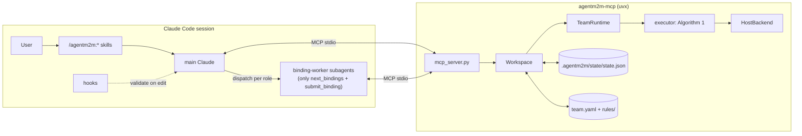

# The AgentM2M Claude Code plugin

This document explains what the AgentM2M plugin does, which problems it
addresses, how it works internally, and how to develop, test, and release it.
It assumes you know Claude Code. The method itself is described in
[`DS-A2A.tex`](DS-A2A.tex), and the engine's mapping onto the paper is in
[`ARCHITECTURE.md`](ARCHITECTURE.md). You do not need to read either first.

**Contents:**
1. [What it is](#1-what-it-is)
2. [Problems it addresses](#2-problems-it-addresses)
3. [Core concepts](#3-core-concepts)
4. [How it works](#4-how-it-works)
5. [Using the plugin](#5-using-the-plugin)
6. [Workspace format](#6-workspace-format)
7. [MCP tool reference](#7-mcp-tool-reference)
8. [Plugin components](#8-plugin-components)
9. [Code map](#9-code-map)
10. [Development guide](#10-development-guide)
11. [Releasing and publishing](#11-releasing-and-publishing)
12. [Invariants: what must not break](#12-invariants-what-must-not-break)
13. [Limitations and future work](#13-limitations-and-future-work)
14. [Troubleshooting](#14-troubleshooting)

---

## 1. What it is

The plugin lets Claude Code run a **team of agent roles** (for example
Analyst → Architect → Developer → Tester) whose hand-offs are
**model-to-model (M2M) transformations** rather than free-text messages.

- Each role owns a typed **view model**: requirements, architecture, code, or tests.
- A deterministic **engine** carries out every hand-off. It matches source
  elements, creates target elements, resolves references, and records **trace
  links**.
- Claude is asked only for the values no rule can compute, such as an API
  signature, a function body, or a test oracle. Each request contains exactly
  the source data the value may depend on (its **footprint**). A value is kept
  only if its **validator** accepts it.
- Because every accepted value is stamped with a digest of its footprint, a
  change redoes **exactly** the values whose footprint changed and nothing else.
  The plugin can preview that set before spending any tokens.
- The team can **gain a role while it runs**. The new role immediately
  receives work for every existing element, with no glue code.

The plugin has two parts:

| Part | Where | Ships as |
|---|---|---|
| Engine and MCP server | `src/agentm2m/` | Python package `agentm2m` (PyPI), started with `uvx` |
| Claude Code plugin | `plugin/agentm2m/` | Plugin directory: skills, agents, hooks, `.mcp.json` |

---

## 2. Problems it addresses

Multi-agent LLM teams fail mostly in the *glue between agents*, not inside
one agent's reasoning. The MAST taxonomy (Cemri et al.) attributes about 44%
of failures to system design and 32% to inter-agent misalignment. The paper
groups these into three deficits, and each one maps to a plugin feature.

| Deficit | Typical symptom in a free-text team | What the plugin does instead |
|---|---|---|
| **P1: Lossy hand-offs.** Text is re-interpreted at every hop. | The Analyst's summary drops a criterion, so no code handles it and no test checks it (MAST 1.4, 2.1, 2.4, 2.5). | Matched rules create one target per source element *by construction*: every criterion gets a test case. Views persist across sessions. |
| **P2: No traceability under change.** Nothing records which artifacts correspond. | After a requirement changes, the team either regenerates everything (expensive) or keeps stale artifacts (wrong) (MAST 1.3, 2.3, 3.1–3.3). | Trace links and footprint stamps yield the exact obligation set. `impact` previews it with no LLM call, `trace_query` shows what derives from what, and the engine (not an agent) decides when the team is done. |
| **P3: Structure lives in prompts.** Roles and topology are prose. | Roles are not enforced, and adding a reviewer means rewiring prompts by hand (MAST 1.2, 1.5). | Write rights are enforced per view. A team change is a higher-order transformation (`team_evolve`): one call, and the new role gets obligations for everything that exists. |

It also addresses **token cost under change**. A free-text team pays again
for every role re-reading the upstream transcript. The plugin pays only for
the bindings a change obliges: the call bound is `k × |Obl(Δ)|`, whatever
the model size. In the paper's pilot, propagating a change cost about 12×
fewer tokens than re-running free-text hand-offs.

What it does **not** address: failures inside a single agent's reasoning
(MAST 1.1, 2.2, 2.6). A validator only checks what it encodes, and content
an author never states is invisible to every check.

---

## 3. Core concepts

| Concept | Meaning in the plugin |
|---|---|
| **View** | A model owned by one agent, conforming to that agent's metamodel (`views:` in `team.yaml`). |
| **Write rights (ω)** | Only a view's owner may edit it (`model_edit … as_agent`). Elements created by hand-offs are **engine-owned** and read-only. |
| **Hand-off** | An ATL-style rule module (`rules/*.agentm2m`). It maps source views to one target view. |
| **Structural binding** | `name <- s.id.toOpName()`: computed deterministically by the engine. |
| **Stochastic binding** | `signature <- @llm('prompt', footprint)`: a value produced by an LLM (Claude, in host mode). |
| **Footprint** | The second `@llm` argument. It is *all* the source data the value may use, and it decides when the value must be redone. |
| **Validator** | `@check expr`: the value is accepted only if this holds. Helpers may return `Rejected("why")`. |
| **Trace link** | Records match → target element, plus per-binding stamps. It is persisted. |
| **Stamp** | A digest of a binding's footprint at acceptance. A mismatch means the value is stale, which is an **obligation**. |
| **Escalation** | After `k` rejections on one footprint the binding stops and waits for a source change or a human. |
| **φ (phi)** | The acceptance predicate, decided by the engine: every match covered, and every value accepted for its *current* footprint. |
| **HOT** | Higher-order transformation: adds an agent, a view, and a hand-off to a running team. |

---

## 4. How it works

### 4.1 Architecture



- The **MCP server** is the only bridge. Skills and agents never touch
  `.agentm2m/state/` directly.
- `Workspace` (`src/agentm2m/workspace.py`) holds every operation and returns
  plain JSON-able dicts. `mcp_server.py` is a thin wrapper, so everything can
  be tested without MCP.
- `TeamRuntime` and the executor are the paper's engine (Algorithm 1),
  extended with a *deferred* backend for host mode.

### 4.2 Host mode: Claude fills the values

By default (`AGENTM2M_LLM=host`) the engine never calls an LLM. Instead, the
following loop runs.

```mermaid
sequenceDiagram
  participant C as Claude / binding-worker
  participant S as MCP server
  participant E as Engine
  C->>S: run
  S->>E: run_to_fixpoint (HostBackend)
  E-->>S: structure built; stale bindings -> pending / blocked
  C->>S: next_bindings(agent)
  S-->>C: [{target_key, binding, prompt, footprint_version, attempts}]
  C->>S: submit_binding(target_key, binding, value, footprint_version)
  S->>E: re-evaluate footprint, check version, run @check
  alt accepted
    E-->>C: accepted (value written, stamp = digest)
  else rejected
    E-->>C: rejected + reason + retry_prompt (attempts left)
  else k-th rejection
    E-->>C: escalated (failed stamp; not offered again)
  else footprint moved
    E-->>C: stale (fetch again)
  end
  C->>S: run (accepted upstream values unblock downstream bindings)
```

The rules that make this sound:

- **Same acceptance path as an in-engine sample.** `submit_binding` calls
  `accept_sample` (`engine/binding.py`), the same function the engine's own
  resample loop uses. That covers `@check`, Lift conformance, and stamping.
- **Footprint-only prompts.** `prompt` is `prompt_b ⊕ footprint`, the complete
  context. `binding-worker` is allowlisted to the two binding tools only, so
  it cannot read the repository.
- **Footprint pinning.** Every offered binding carries `footprint_version` (the
  digest its prompt was built from). A value submitted for an older version
  is refused as `stale`. This matters when one batch contains both a signature
  and the code body that reads it.
- **Blocked bindings.** If a footprint reads an upstream value that is not yet
  accepted (for example, a body whose signature is still unfilled), the
  binding is reported as *blocked*. It is not offered with empty context.
- **Escalation semantics match Algorithm 1.** Rejections are counted per
  footprint in the trace link (`attempts`, `rejections`). The `k`-th one sets a
  failed stamp. A footprint change clears it and grants a fresh budget.

With an engine backend (`AGENTM2M_LLM=anthropic|openai|ollama|mock`), `run`
samples and validates directly, exactly as in the paper's prototype, and
`next_bindings` is refused.

### 4.3 Change propagation

1. `model_edit(view, ops, as_agent)` checks write rights and engine ownership.
   It applies the ops **atomically**: on any error the snapshot is restored.
2. It immediately re-runs the **structural** phase of every hand-off with a
   deferred backend. Targets are created or deleted and structural copies are
   updated, but nothing is sampled. This is the paper's "a change re-runs
   R^str deterministically", and it means `status` and `acceptance` reflect
   the change at once.
3. Stale stochastic bindings are now open **obligations**. `impact` computes
   the same set on a scratch copy, optionally *before* applying the ops,
   without any LLM call.
4. `run` (plus `next_bindings`/`submit_binding` in host mode) discharges them.
   A re-derived value that is **identical** stops propagation along the paths
   it alone determines. A changed value obliges the next hop.

DevTeam example (live-tested): tightening `S2.1` obliges exactly
`{Operation#op_s2.signature, TestCase#S2.1.oracle, CodeEdit#op_s2.body}`. The
body is obliged directly, because T2's footprint reads the criteria that T1
copies onto the operation. S1's artifacts are never touched.

### 4.4 Evolving the team (HOT)

`team_evolve(agent, view, view_spec, handoff, rule)` builds the new view
metamodel, validates the rule (it must parse, target the new view, read
existing views, and every created class needs a root slot), then registers
the agent, view, write rights, and hand-off. The new hand-off starts with an
**empty trace model**, so its first run treats every existing match as new.
The new agent receives obligations for all existing elements. The evolution
is stored in `state.json` and replayed on every load (models@run.time). The
design-time `team.yaml` is never rewritten.

### 4.5 Persistence

`.agentm2m/state/state.json` (format version 1) holds:
- every view model, as a JSON tree with path-based uids;
- non-containment and cross-view references, stored as uids;
- the engine **target key** of every element a hand-off created;
- every trace model;
- the list of runtime evolutions.

This replaces in-process-only state, so a team saved by one process resumes
incrementally in another.

Before each operation, the workspace compares a fingerprint (mtime and size)
of `team.yaml`, `rules/**`, and `state.json`, and reloads if anything changed
on disk. Writes are atomic (temp file + `os.replace`) under an `fcntl` lock.

---

## 5. Using the plugin

### 5.1 Requirements

- Claude Code with plugin support.
- [uv](https://docs.astral.sh/uv/). The MCP server and hooks start the engine
  with `uvx`.
- Python ≥ 3.11 (uv provisions it if missing).

### 5.2 Install

The plugin is not public yet (see [§11](#11-releasing-and-publishing)). Once
it is:

```
/plugin marketplace add <owner>/<repo>
/plugin install agentm2m@agentm2m
```

From a checkout, before the engine is on PyPI:

```bash
plugin/scripts/dev-install.sh
export AGENTM2M_ENGINE=/path/to/DS-A2A   # uvx runs the local engine
claude
```

### 5.3 Commands

| Command | What it does |
|---|---|
| `/agentm2m:init [devteam\|research\|incident\|custom]` | Creates `.agentm2m/` from a template and validates it. |
| `/agentm2m:run [agent]` | Runs hand-offs, dispatches one `binding-worker` per owning role, repeats until nothing is pending, then reports φ and escalations. |
| `/agentm2m:change <description>` | Turns the description into `model_edit` ops, previews `impact`, applies, propagates, and reports the downstream closure. |
| `/agentm2m:evolve <new role>` | Designs a view and hand-off (or uses DevTeam's ready-made SecurityReviewer), then calls `team_evolve` and runs. |
| `/agentm2m:status [element key]` | Team overview; with a key, shows its trace closure. |
| `/agentm2m:author-handoff <goal>` | Help writing `team.yaml` views and `.agentm2m` rules. |

`agentm2m-concepts` is a background skill that Claude loads on its own in
projects with `.agentm2m/`.

### 5.4 Templates

| Template | Roles | Demonstrates |
|---|---|---|
| `devteam` | Analyst, Architect, Developer, Tester (+ SecurityReviewer via HOT) | The paper's running example: guards (`S3` is a draft), trace-resolved references, a structural criteria copy, an executable-oracle validator, and a HOT extension in `rules/extra/`. |
| `research` | LiteratureReviewer, ExperimentDesigner, ReportWriter | A multi-source (n:m) hand-off with a footprint drawn from two views. |
| `incident` | Monitor, Triage, Remediation, Postmortem | A Lift binding (`self <- @llm`, one JSON value filling several attributes) and a dry-run script validator. |

### 5.5 Configuration

| Variable | Default | Effect |
|---|---|---|
| `AGENTM2M_LLM` | `host` | Who fills bindings: `host`, `anthropic`, `openai`, `ollama`, or `mock`. |
| `AGENTM2M_MODEL` | `$LLM_MODEL` | Model for engine backends. |
| `AGENTM2M_MAX_RESAMPLES` | `$LLM_MAX_RESAMPLES` (3) | `k`: attempts per footprint before escalation. |
| `AGENTM2M_ENGINE` | `agentm2m==<version>` | The `uvx --from` spec for the MCP server and hook. Set it to a checkout path for development. |
| `AGENTM2M_PROJECT_DIR` | `$CLAUDE_PROJECT_DIR`, then the cwd | The project containing `.agentm2m/`. |
| `ANTHROPIC_API_KEY`, `OPENAI_API_KEY`, `OLLAMA_BASE_URL`, `LLM_TEMPERATURE` | – | Read through `.env` / `agentm2m.config` for engine backends. |

The engine also works without Claude Code:

```bash
agentm2m workspace templates
agentm2m workspace init devteam
agentm2m workspace --llm anthropic run
agentm2m workspace impact
agentm2m workspace status --brief
```

---

## 6. Workspace format

```
.agentm2m/
  team.yaml               design-time team model (commit it)
  rules/*.agentm2m        hand-off modules (commit them)
  rules/helpers.py        OCL-callable helpers and validators (executed by the engine)
  rules/extra/            optional modules for later HOTs (devteam)
  state/state.json        engine-managed: models, traces, evolutions (optional to commit)
  state/.lock             file lock
```

### 6.1 `team.yaml`

```yaml
name: devteam
views:
  Req:
    owner: Analyst                       # exactly one owner per view
    classes:
      Epic:      {attributes: [name]}
      Criterion: {attributes: [id, text]}
      UserStory:
        attributes: [id, title, status]  # string by default; {n: int}, {ok: boolean}, {tags: {type: string, many: true}}
        references:
          epic: Epic                                       # same view, single, non-containment
          criteria: {type: Criterion, many: true, containment: true}
    root: {class: ReqModel, slots: {epics: Epic, stories: UserStory}}
    seed:                                # initial model (applied once, when no state exists)
      epics: [{name: E1}]
      stories:
        - {id: S1, title: create a task, status: accepted, epic: "Epic#E1",
           criteria: [{id: S1.1, text: a title is required}]}
  Arch:
    owner: Architect
    classes:
      Operation:
        attributes: [name, signature, criteria]
        references: {component: Component, story: Req.UserStory}   # View.Class = cross-view
    root: {class: ArchModel, slots: {operations: Operation}}
handoffs:
  - {name: Req2Arch, rule: rules/Req2Arch.agentm2m}   # target view is read from the module
```

Rules:
- Views are built in dependency order, and cyclic cross-view references are rejected.
- Classes may `extends:` others in the same view.
- Every class a rule matches or creates needs an `id` or `name` attribute,
  which becomes its trace key (`Type#value`).
- Every class a rule creates needs a root slot.
- Reference values in seeds and edits are element keys (`Epic#E1`), optionally
  view-qualified (`Req:Criterion#S1.1`).

### 6.2 Hand-off modules

```
module Req2Arch;
create OUT : Arch from IN : Req;                 -- multi-source: from IN1 : A, IN2 : B
uses 'helpers.py';

rule Story2Operation {
  from s : Req!UserStory (s.status = #accepted)                    -- pattern + guard
  to  op : Arch!Operation (
    name      <- s.id.toOpName(),                                   -- structural
    component <- s.epic,                                            -- resolved through the trace
    criteria  <- s.criteria.criteriaText(),                         -- structural copy
    signature <- @llm('Derive an API signature ...', s.criteria),   -- stochastic: prompt, footprint
    @check signature.parses() and signature.params()->notEmpty() )
}
```

The full language (an OCL subset, Lift bindings, and validator conventions)
is in the `author-handoff` skill (`plugin/agentm2m/skills/author-handoff/SKILL.md`)
and in [`ARCHITECTURE.md`](ARCHITECTURE.md).

### 6.3 `model_edit` ops

```json
{"op": "create", "feature": "stories", "parent": "<key, optional; default root>", "value": {"id": "S4", "epic": "Epic#E1", "criteria": [{"id": "S4.1", "text": "..."}]}}
{"op": "set",    "key": "Criterion#S2.1", "values": {"text": "..."}}
{"op": "delete", "key": "UserStory#S3"}
```

---

## 7. MCP tool reference

Server name: `agentm2m`. Inside Claude Code the tools are named
`mcp__plugin_agentm2m_agentm2m__<tool>`. A user error becomes an MCP tool
error with an actionable message, not a traceback.

| Tool | Arguments | Returns / effect |
|---|---|---|
| `team_init` | `template="devteam"`, `force=false` | Copies the template to `.agentm2m/`, loads, saves, returns status. `force` discards existing state. |
| `team_status` | – | Agents → views, views (owner, element count), hand-offs (sources, target, trace links, binding states), totals, evolutions, φ, and the open items (first 25). With no workspace: the template list and a hint. |
| `team_validate` | – | `{ok, errors, handoffs[{name, rules[{rule, matches, stochastic_bindings}]}]}`. |
| `model_show` | `view`, `key?`, `depth=3` | A view tree or one element. Engine-created elements show `engine_owned`. |
| `model_edit` | `view`, `ops[]`, `as_agent` | Atomic edit, then structural propagation. Returns `{applied, open_obligations}`. |
| `impact` | `view?`, `ops?`, `as_agent?` | A no-LLM preview: `obligations` (re-derive, with agent), `new_bindings`, `created`, `deleted`, `still_escalated`, `llm_calls_upper_bound`. |
| `run` | `max_passes?` | Runs to a fixpoint. Per hand-off: created/deleted/resampled/escalations/pending/blocked. Also obligations discharged, escalations, pending count and preview, and φ. |
| `next_bindings` | `agent?`, `limit=5` | Host mode only: `bindings[{handoff, rule, target_key, binding, prompt, footprint_version, attempts, max_attempts, kind: new\|stale, agent}]`, plus `remaining`, `blocked_on_upstream`, `escalations`. |
| `submit_binding` | `target_key`, `binding`, `value`, `footprint_version` | `status`: `accepted`, `rejected` (+`reason`, `retry_prompt`, `attempts_left`), `escalated`, `already_accepted`, or `stale`. |
| `trace_query` | `key`, `transitive=true` | `upstream` (the sources it was generated from) and `downstream` (everything generated from it, transitively). |
| `team_evolve` | `agent`, `view`, `handoff`, `rule`, `view_spec?` or `view_spec_file?`, `rule_text?` | The HOT. Returns `{existing_matches}`. Nothing changes on error, and a newly written rule file is removed. |
| `acceptance` | – | `{phi, open[], open_total}`. Binding states: `fresh`, `stale`, `missing`, `escalated`, `uncovered`. |

---

## 8. Plugin components

```
plugin/
├── .claude-plugin/marketplace.json   dev marketplace "agentm2m-dev" -> ./agentm2m
├── agentm2m/                         the plugin (slug "agentm2m": never rename)
│   ├── .claude-plugin/plugin.json
│   ├── .mcp.json                     uvx --from ${AGENTM2M_ENGINE:-agentm2m==X} --with mcp>=1.2 agentm2m-mcp
│   ├── skills/<7 skills>/SKILL.md
│   ├── agents/binding-worker.md      tools: next_bindings, submit_binding ONLY
│   ├── agents/handoff-architect.md   Read/Grep/Glob/Edit/Write + status/validate/impact/model_show
│   ├── hooks/hooks.json
│   ├── hooks/session-start.sh        offline; announces a .agentm2m/ workspace
│   ├── hooks/validate-on-edit.sh     after Edit/Write of team.yaml, *.agentm2m, helpers.py, *.view.yaml:
│   │                                 `agentm2m workspace validate --brief`; exit 2 feeds errors to Claude
│   ├── README.md  CHANGELOG.md  LICENSE
├── scripts/                          see §10–11
└── tests/                            plugin-level tests
```

`claude --plugin-dir plugin/agentm2m plugin details agentm2m` reports 7 skills,
2 agents, 2 hooks, and 1 MCP server, at about 0.9k tokens of always-on context.

Both hooks **fail soft**: if `uvx` is missing, or the edited file is not part
of the team, they exit 0 silently.

---

## 9. Code map

| Module | Responsibility |
|---|---|
| `agentm2m/mcp_server.py` | MCP tools (SDK 2.x `MCPServer`, falling back to 1.x `FastMCP`). Maps `WorkspaceError` and other exceptions to `ToolError`. Entry point `agentm2m-mcp`. |
| `agentm2m/workspace.py` | `Workspace`: load/build from spec and state, reload-on-change, locking, and every operation in §7. `binding_states`, `_apply_ops`, `_propagate_structure`, scratch-copy `impact`. |
| `agentm2m/team/spec.py` | `team.yaml` → metamodels (`build_view_metamodel`, `order_views`), seeds and edit values (`create_element`, `set_values`), key resolution (`resolve_key`, `resolve_refs`). |
| `agentm2m/store.py` | `dump_models` / `load_models`: a lossless JSON model store with cross-view references and target keys. |
| `agentm2m/team/runtime.py` | `TeamRuntime.run_to_fixpoint` (with host-mode `incomplete` seeding), `submit_binding`, `unstamped_targets`, `stamps_fresh`, `acceptance_holds`. |
| `agentm2m/engine/executor.py` | Algorithm 1. Records `PendingBinding`s in `HandoffReport.pending` / `.blocked` when the backend is deferred. |
| `agentm2m/engine/binding.py` | `accept_sample` (the shared acceptance path), `build_prompt`, `apply_stochastic_binding` (the deferred branch raises `PendingSample`), `_footprint_blocked`. |
| `agentm2m/engine/trace.py` | `TraceLink`, now also with `attempts` / `rejections`; persisted. |
| `agentm2m/llm/host_backend.py` | `HostBackend` (`deferred = True`, `incomplete` set). |
| `agentm2m/llm/base.py` | `PendingSample`: deliberately *not* an `LLMError`, so it never consumes the resample budget. |
| `agentm2m/cli.py` | `agentm2m workspace {templates,init,validate,status,run,impact}`. |
| `agentm2m/templates/` | Package data, so uvx installs find it wherever they live. |

---

## 10. Development guide

### 10.1 Setup

```bash
python3 -m venv .venv && source .venv/bin/activate
pip install -e ".[dev]"      # engine + pytest, ruff, mcp, build, twine
pip install uv               # or install uv system-wide; provides uvx
```

### 10.2 Local loop with Claude Code

```bash
export AGENTM2M_ENGINE="$PWD"                       # .mcp.json and the hook use the checkout
claude --plugin-dir plugin/agentm2m                 # no install needed
claude --plugin-dir plugin/agentm2m mcp list        # expect: plugin:agentm2m:agentm2m ✔ Connected
```

`pyproject.toml` sets `[tool.uv] cache-keys` over `src/**`, so uvx rebuilds the
local engine whenever its sources change. Without it, uv rebuilds only when
`pyproject.toml` changes. Restart the Claude Code session to restart the MCP
server.

For a headless end-to-end check in a scratch repo:

```bash
claude --plugin-dir plugin/agentm2m -p "/agentm2m:run" \
  --allowedTools mcp__plugin_agentm2m_agentm2m Skill Agent Task --max-turns 50
agentm2m workspace status --brief
```

To test marketplace installation without touching your real configuration,
set `CLAUDE_CONFIG_DIR=$(mktemp -d)`.

### 10.3 Tests

```bash
python -m pytest tests/ plugin/tests/ -q     # 109 tests, offline, about 12 s
plugin/scripts/validate.sh                   # + strict manifests, template validation
```

| Suite | Count | Covers |
|---|---|---|
| `tests/` (original) | 39 | Parser, engine, examples 01–06, evaluation pipeline. |
| `tests/test_host_backend.py` | 5 | Host mode defers exactly what an engine backend samples; submit to φ; escalation parity; φ freshness in backend mode. |
| `tests/test_team_spec_and_store.py` | 7 (+params) | Types, `extends`, cross-view refs, spec error messages, store round trip of every template. |
| `plugin/tests/test_host_mode.py` | 13 | Structure first; footprint-only prompts; blocked/unblocked; rejection feedback; escalation; footprint pinning; immediate structural propagation. |
| `plugin/tests/test_change_and_persistence.py` | 7 | Exact `Obl(Δ)`; identical re-derivation stops; changed value propagates; add/remove criteria; **separate OS processes**; concurrent instances. |
| `plugin/tests/test_edit_trace_hot.py` | 12 (+params) | ω, engine ownership, atomic edits, bad-op messages, trace closure, HOT (retroactive obligations, persistence, rollback, path traversal). |
| `plugin/tests/test_mcp_server.py` | 2 | A real `agentm2m-mcp` subprocess over stdio: all 12 tools, a full loop to φ, readable tool errors, the mock backend. |
| `plugin/tests/test_plugin_package.py` | 10 | Manifests, version sync, agent allowlists ⊆ server tools, skill frontmatter, real hook executions, `claude plugin validate --strict`, `plugin details`. |

Tests that need `claude` or `uvx` are skipped when those are not installed.
`plugin/tests/conftest.py::fill_all` plays the `binding-worker`: reuse it in new tests.

### 10.4 Common changes

- **New MCP tool:**
  1. Add a `Workspace` method that returns a dict.
  2. Add a thin `@mcp.tool()` wrapper with a precise docstring (it is the tool description Claude sees).
  3. Add it to `EXPECTED_TOOLS` in `test_mcp_server.py`.
  4. If agents should use it, add its full `mcp__plugin_agentm2m_agentm2m__…` name to their `tools:`.
  5. Mention it in the relevant skill.
- **New skill:** add `plugin/agentm2m/skills/<name>/SKILL.md` with `name` and
  `description` frontmatter, then update the skill set asserted in
  `test_plugin_package.py`. Keep descriptions short: they are always in context.
- **New template:** add `src/agentm2m/templates/<name>/team.yaml` and `rules/`.
  It is picked up automatically by `list_templates`, by `validate.sh`, and by
  the store round-trip test. Package-data globs already include `*.yaml`,
  `*.agentm2m`, and `*.py`.
- **Engine semantics:** keep [§12](#12-invariants-what-must-not-break) intact,
  and run the full suite plus one live `/agentm2m:run` and `/agentm2m:change`.

### 10.5 Lint

`ruff check` with the repository defaults. Tests keep `# noqa: E402` after
`sys.path` setup, and deliberate broad excepts carry `# noqa: BLE001 - reason`,
matching the existing code.

---

## 11. Releasing and publishing

The paper is under **double-anonymous review**. Publishing a package or a
public repository under the authors' names would de-anonymize it, so every
public step is gated:

- `release.sh --publish` refuses unless `AGENTM2M_ALLOW_PUBLIC=1` is set.
- The CI publish job only runs on a `v*` tag **and** when the repository
  variable `ALLOW_PUBLIC == 'true'`.

| Script | Purpose |
|---|---|
| `scripts/bump_version.py X.Y.Z` / `--check` | One version across `pyproject.toml`, `__version__`, `plugin.json`, the marketplace entries, and the engine pins in `.mcp.json` and the hook. `--check` also warns if `CHANGELOG.md` lacks the section. |
| `scripts/validate.sh` | Strict manifest validation, JSON syntax, version check, templates, all tests. |
| `scripts/build.sh` | Wheel and sdist, `twine check`, wheel-contents check (grammar, templates, entry point), a fresh `uvx --isolated` install smoke test, and `dist/agentm2m-plugin-X.zip`. |
| `scripts/release.sh` | Dry run by default: validate, build, and write `dist/submission-entry.json` plus a root marketplace preview. |
| `scripts/submission_entry.py` | Writes the official-directory entry (`git-subdir`, `path: plugin/agentm2m`, pinned `ref` and `sha`) and, with `--write-root-marketplace`, `/.claude-plugin/marketplace.json`. |
| `scripts/dev-install.sh [--remove]` | Adds the dev marketplace and installs `agentm2m@agentm2m-dev` into your real Claude Code. |

**Release steps, after the review:**
1. `scripts/bump_version.py X.Y.Z`, then add a `## X.Y.Z` section to `plugin/agentm2m/CHANGELOG.md`, then commit.
2. `AGENTM2M_ALLOW_PUBLIC=1 scripts/release.sh --publish --target testpypi --repo-url https://github.com/<org>/<repo>`.
   This uploads to TestPyPI and smoke-tests a `uvx` install from it.
3. The same command with `--target pypi`. This uploads to PyPI, writes and
   validates the root marketplace, commits it, tags `vX.Y.Z`, pushes, and
   writes a submission entry pinned to the tag's commit. Alternatively, push
   the tag and let CI publish through PyPI trusted publishing (configure the
   `pypi` environment and set `ALLOW_PUBLIC=true` first).
4. Users can now `/plugin marketplace add <org>/<repo>` and `/plugin install agentm2m@agentm2m`.
5. **Anthropic's official directory:** submit `dist/submission-entry.json`
   through https://clau.de/plugin-directory-submission. There is no upload
   API, and Anthropic reviews quality and security. The plugin's `name`
   (`agentm2m`) is an immutable slug once published. Change `displayName`
   instead of renaming.

---

## 12. Invariants: what must not break

1. **Structure is never delegated.** Target elements, references, and trace
   links are a function of the source models alone. `@llm` targets primitive
   attributes only.
2. **One acceptance path.** Engine samples and host submissions both go
   through `accept_sample`. Never write a value to a target before its
   `@check` passes.
3. **Footprint discipline.** A host prompt contains only `prompt_b ⊕ footprint`.
   A value is stamped with the digest of the footprint it was produced from
   (`footprint_version`), never a newer one.
4. **Escalate, never loop.** At most `k` rejections per footprint; failed
   stamps suppress re-offers until the footprint changes. A transport failure
   (`LLMError`) is not a content rejection.
5. **φ is decided by the engine.** It requires coverage, fresh stamps for
   every stochastic binding, and no escalations.
6. **Write rights and engine ownership** are enforced on every edit, and edits are atomic.
7. **Backward compatibility of the engine API** for `examples/` and `evaluation/`.
   The original 39 tests must keep passing.
8. **Never read or write `.agentm2m/state/` outside `Workspace`.**

---

## 13. Limitations and future work

- **Trust model.** `rules/helpers.py` is executed by the engine. Template
  validators run generated code in a subprocess with a timeout, but not in a
  sandbox. Open only workspaces you trust.
- **Concurrency.** Writes are atomic and locked, and every operation reloads
  on external change. However, the whole load-modify-save sequence across two
  *processes* is not one transaction, so concurrent edits from two Claude Code
  sessions can race. Within one session, operations are serialized by a lock.
- **`impact` lists direct obligations.** Further hops depend on whether
  re-derived values actually change, which no preview can know.
- **An empty source attribute in a footprint** keeps the binding blocked
  until it is filled.
- **Metamodel evolution.** Changing `team.yaml` so that stored models no
  longer fit fails with a clear error. There is no migration yet; the reset
  is `team_init(force=true)`, which loses state.
- **One owner per view**, and element keys must come from an `id` or `name` attribute.
- **Rules with several target patterns** share one trace link's stamps
  (pre-existing engine behavior). All templates use one target pattern per rule.
- **The first hook or MCP start** downloads the engine through `uvx`, which takes a few seconds.
- **From the paper's roadmap:**
  - learning views and relation models (RC1);
  - bidirectional hand-offs, where a developer edits upstream intent (RC2);
  - evidence at scale (RC3).

---

## 14. Troubleshooting

| Symptom | Cause / fix |
|---|---|
| `agentm2m` MCP server fails to connect | `uvx --version` is missing; or `agentm2m==X` is not on PyPI yet, so set `AGENTM2M_ENGINE=/path/to/checkout`. Check with `claude mcp list`. |
| Engine changes are not picked up | Restart the Claude Code session (the MCP server is long-lived). Local checkouts rebuild via `cache-keys`. |
| `write rights (omega)` error | Edit as the view's owner (`team_status` → `agents`). |
| `engine-owned` error | That element is a hand-off target: change its source view instead. |
| Binding keeps coming back `stale` | Its footprint changed after the prompt was issued: call `next_bindings` again and submit with the new `footprint_version`. |
| Escalations | The validator kept rejecting for this footprint. Clarify the source (for example the criterion) or relax the validator in `helpers.py`. A footprint change grants a new budget. |
| `stored models no longer fit team.yaml` | You changed classes or attributes that stored elements use. Revert the change, or `team_init(force=true)` to start over. |
| Hook reports `workspace INVALID` after an edit | The message names the rule or spec error; fix it. `team_validate` gives details. |
